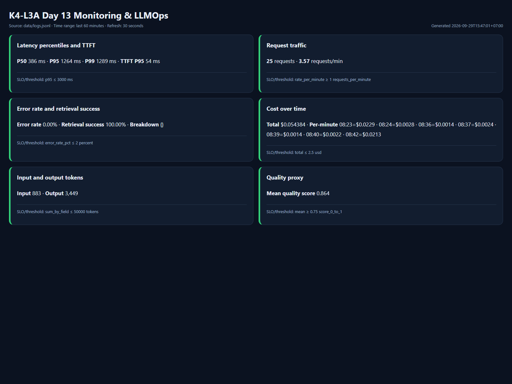
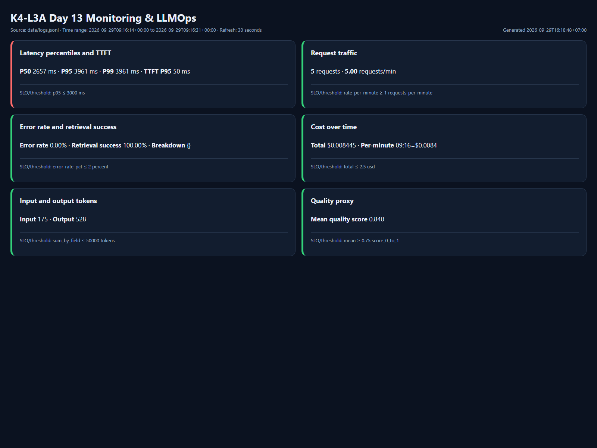

# Báo cáo cá nhân — K4-L3A Day 13 Monitoring & LLMOps

> Mỗi học viên hoàn thiện một file duy nhất này. Khi dẫn evidence, dùng đường dẫn tương đối, ví dụ `evidence/07-trace-waterfall.png`.

## 1. Thông tin học viên

- **Họ và tên:** Đinh Ngọc Đức
- **MSSV:** 2A202602935
- **Lớp:** K4-L3A
- **Repository URL:** https://github.com/dinhngocduc1311/K4-L3-DAY13-DinhNgocDuc-2A202602935-Monitoring-LLMOps
- **Commit SHA source/evidence đã audit:** `75a87af7f12c484f735a5374199514cb0d503c98`
- **Commit SHA nộp cuối:** dùng `HEAD` của commit cập nhật báo cáo này trên remote; SHA được nộp cùng URL repo trên LMS/Codelabs.
- **Challenge ID:** `day13-k4-l3a-monitoring-llmops-v1`
- **Tên project Langfuse cá nhân:** `day13-k4-l3a-2A202602935`

## 2. Evidence index

Điền đúng đường dẫn tới evidence thực tế. Có thể đổi tên hoặc dùng nhiều ảnh nếu cần.

| Evidence | Đường dẫn |
|---|---|
| CP0 baseline | [`evidence/cp0-baseline.txt`](evidence/cp0-baseline.txt) |
| Pytest cuối | [`evidence/01-pytest.txt`](evidence/01-pytest.txt) |
| Log validator | [`evidence/02-log-validator.txt`](evidence/02-log-validator.txt) |
| Dashboard validator | [`evidence/03-dashboard-validator.txt`](evidence/03-dashboard-validator.txt) |
| Structured log | [`evidence/04-structured-log.txt`](evidence/04-structured-log.txt) |
| PII redaction | [`evidence/05-pii-redaction.txt`](evidence/05-pii-redaction.txt) |
| Trace list | [`evidence/06-trace-list.png`](evidence/06-trace-list.png) |
| Trace waterfall | [`evidence/07-trace-waterfall.png`](evidence/07-trace-waterfall.png) |
| Trace metadata | [`evidence/08-trace-metadata.png`](evidence/08-trace-metadata.png) |
| Prompt versions | [`evidence/09-prompt-versions.png`](evidence/09-prompt-versions.png) |
| Prompt rollback | [`evidence/10-prompt-rollback.png`](evidence/10-prompt-rollback.png) |
| Dashboard runtime | [`evidence/11-dashboard-overview.png`](evidence/11-dashboard-overview.png) |
| Incident metric | [`evidence/12-incident-metric.png`](evidence/12-incident-metric.png) |
| Incident log | [`evidence/13-incident-log.txt`](evidence/13-incident-log.txt) |
| Incident trace | [`evidence/14-incident-trace.png`](evidence/14-incident-trace.png) và [`evidence/14-incident-trace.txt`](evidence/14-incident-trace.txt) |
| Bonus audit log | [`evidence/15-audit-log.txt`](evidence/15-audit-log.txt) |

## 3. Kết quả kỹ thuật

| Nội dung | Baseline | Kết quả cuối | Nhận xét |
|---|---|---|---|
| `validate_logs.py` | 30/100 | 100/100 | 92 records, 44 correlation IDs, không thiếu schema/enrichment. |
| `validate_dashboard.py` | 6/6 panel | 6/6 panel | Contract YAML và dashboard runtime đều đủ sáu panel. |
| `pytest` | 22 passed | 28 passed | Chạy bằng Python 3.12.9 trong `.venv`. |
| Số traces hợp lệ | 10 root observations | 10/10 root có 2 child observations | Tự tạo trong project Langfuse cá nhân. |
| Số PII leak | 0 | 0 | Kiểm tra email, điện thoại Việt Nam, CCCD và thẻ. |
| Latency P95 / TTFT P95 | 1275 ms / 53 ms | 1264 ms / 54 ms | Snapshot CP2 trên 25 request trong 60 phút. |
| Retrieval success rate | 100% (10/10) | 100% (25/25) | Tất cả `response_sent` có `tool_success=true`. |

### CP0 — Setup và baseline

- **Ngày chạy:** 2026-09-29 (Asia/Ho_Chi_Minh)
- **Commit baseline:** `13b606680ae4a3072eda90334959b632fe4ecba0`
- **Health:** `ok=true`, `tracing_enabled=true`, toàn bộ incident flag tắt.
- **Runtime:** 10/10 request trả HTTP 200; `data/logs.jsonl` được tạo.
- **Langfuse:** xác thực thành công và đọc lại được 10 root observations mới trong đúng project cá nhân.
- **Evidence:** [`evidence/cp0-baseline.txt`](evidence/cp0-baseline.txt)

## 4. Logging và PII

- **Cách tạo/nhận và truyền correlation ID:** Middleware xóa context cũ ở đầu mỗi request, dùng `x-request-id` nếu có hoặc sinh `req-<8-hex>`, bind vào structlog, lưu trong `request.state`, rồi trả lại ở body và header `x-request-id` cùng `x-response-time-ms`.
- **Các metadata được ghi vào structured log:** `correlation_id`, `user_id_hash`, `session_id`, `feature`, `model`, `env`; response bổ sung latency, TTFT, token, cost, quality và trạng thái retrieval.
- **Cách bảo đảm PII được scrub trước khi ghi:** Processor `scrub_event` duyệt đệ quy chuỗi trong toàn bộ event sau bước format exception và trước `JsonlFileProcessor`/`JSONRenderer`; user ID chỉ được ghi dưới dạng SHA-256 rút gọn.
- **Cách kiểm chứng kết quả:** `python scripts/validate_logs.py` đạt 100/100 trên 92 records và 44 correlation IDs; `python -m pytest -q` đạt 28 passed; request `req-cafebabe` xác nhận header/body/log khớp và không còn PII nguyên văn. Xem [`evidence/02-log-validator.txt`](evidence/02-log-validator.txt), [`evidence/04-structured-log.txt`](evidence/04-structured-log.txt) và [`evidence/05-pii-redaction.txt`](evidence/05-pii-redaction.txt).
- **Source và tests:** [`app/middleware.py`](../app/middleware.py), [`app/logging_config.py`](../app/logging_config.py), [`app/pii.py`](../app/pii.py), [`tests/test_chat_observability.py`](../tests/test_chat_observability.py) và [`tests/test_pii.py`](../tests/test_pii.py).

## 5. Tracing và prompt versioning

- **Cách xác nhận traces do chính tôi tạo trong project cá nhân:** Dùng API key của project `day13-k4-l3a-2A202602935`, gửi workload mới rồi đọc lại observation từ chính project; 10/10 request cuối có đủ cây trace. UI hiện có 49 root observations: [`evidence/06-trace-list.png`](evidence/06-trace-list.png).
- **Cấu trúc root/retrieval/generation observations:** Root `lab-agent-run` có hai child cùng parent: `retrieval` loại RETRIEVER và `fake-llm-generation` loại GENERATION. Generation ghi model, managed prompt, usage, cost và TTFT; input/output chỉ là cấu trúc hoặc preview đã scrub. Xem [`evidence/07-trace-waterfall.png`](evidence/07-trace-waterfall.png) và [`evidence/08-trace-metadata.png`](evidence/08-trace-metadata.png).
- **Cách nối trace với log:** `correlation_id` được bind trên root trace và structured log; ví dụ `req-048dbdf0` nối log với trace `7e27b81818c5fa1ed6af951882f15cd7`.
- **Prompt name:** `day13-chat`.
- **Version/label baseline:** v1, labels hiện tại `baseline` và `production`.
- **Version/label candidate:** v2, labels hiện tại `candidate` và `latest`.
- **Trace ID của mỗi version:** v1 baseline `b765d7a8fc33e12201536bbd8c0905af`; v2 candidate `ed707ed50059918012997f80e86fe839`; v2 khi được promote production `91525b42459d64bb036d765a8e1fea80`.
- **Cách promote và rollback `production`:** Chuyển label `production` từ v1 sang v2, chạy và xác minh trace dùng version 2; sau đó gắn lại `production` cho v1. UI xác nhận v1 có `production/baseline`, còn v2 có `candidate/latest`: [`evidence/09-prompt-versions.png`](evidence/09-prompt-versions.png), [`evidence/10-prompt-rollback.png`](evidence/10-prompt-rollback.png). Trace IDs và kiểm tra API bổ sung nằm tại [`evidence/cp2-langfuse-validation.txt`](evidence/cp2-langfuse-validation.txt).
- **Source và tests:** [`app/agent.py`](../app/agent.py), [`app/tracing.py`](../app/tracing.py), [`app/prompt_management.py`](../app/prompt_management.py) và [`tests/test_agent_prompt_trace.py`](../tests/test_agent_prompt_trace.py).

## 6. Dashboard, SLO và alerts

- **Dashboard và sáu panel:** Dashboard HTML đọc `data/logs.jsonl` trong 60 phút và render đúng latency/TTFT, traffic, error/retrieval success, cost, token và quality; mỗi panel có tên, đơn vị và threshold. Runtime snapshot: [`evidence/11-dashboard-overview.png`](evidence/11-dashboard-overview.png).
- **SLO và lý do chọn:** 99.5% request thành công có latency ≤ 3000 ms trong cửa sổ 28 ngày. Baseline P95 1275 ms nên 3000 ms có headroom cho dao động bình thường nhưng vẫn bắt được tail latency ảnh hưởng người dùng.
- **Cách tính error budget:** `total_requests × (1 - 0.995)`, tương đương 5 bad events/1000 request hoặc 50/10000. Snapshot CP2 có 25/25 good events nên SLI 100%, tiêu thụ 0% budget.
- **Ba alert và runbook tương ứng:** `high_user_latency` (critical, 5m), `elevated_errors_or_retrieval_failures` (critical, 5m) và `quality_regression` (warning, 15m); cả ba có owner, Slack `#day13-llmops-alerts` và runbook Metrics → Logs → Traces. Xem [`config/slo.yaml`](../config/slo.yaml), [`config/alert_rules.yaml`](../config/alert_rules.yaml), [`docs/alerts.md`](../docs/alerts.md) và [`evidence/03-dashboard-validator.txt`](evidence/03-dashboard-validator.txt).
- **Dashboard implementation:** [`config/dashboard.yaml`](../config/dashboard.yaml), [`scripts/render_dashboard.py`](../scripts/render_dashboard.py) và [`tests/test_render_dashboard.py`](../tests/test_render_dashboard.py).
- **Automation đề nghị bonus:** `scripts/render_dashboard.py` đọc JSONL, áp dụng time range và tự render sáu panel/threshold thành HTML; test tự động kiểm tra đủ sáu panel và khả năng cô lập cửa sổ incident. Lệnh tái hiện: `python scripts/render_dashboard.py`; với incident dùng thêm `--from-time` và `--to-time`.
- **Audit log đề nghị bonus:** Mỗi request ghi một record riêng vào `data/audit.jsonl` với schema version, timestamp, correlation ID, actor đã hash, action/resource/outcome và details đã scrub. Retention mặc định giữ 1000 record gần nhất qua `AUDIT_RETENTION_RECORDS`; truy vấn bằng `python scripts/query_audit.py --outcome failure` hoặc `--correlation-id <id>`. Source/test/evidence: [`app/audit.py`](../app/audit.py), [`scripts/query_audit.py`](../scripts/query_audit.py), [`tests/test_audit.py`](../tests/test_audit.py), [`evidence/15-audit-log.txt`](evidence/15-audit-log.txt).
- **Phạm vi bonus:** Đề nghị +5 automation và +5 audit log, chạm trần 10 điểm; không claim cost optimization vì chưa có before/after cùng workload và tổng bonus không vượt 10.

## 7. Điều tra challenge

- **Challenge ID:** `day13-k4-l3a-monitoring-llmops-v1`; file Coach cung cấp có cohort K4, đủ schema, được `.gitignore` và không tracked.
- **Khoảng thời gian điều tra:** `2026-09-29T09:16:14Z–09:16:31Z`.
- **Triệu chứng từ metrics:** 5/5 request trả HTTP 200 nhưng latency P50/P95/P99 là `2657/3961/3961 ms`; P95 vượt SLO 3000 ms trong khi TTFT P95 chỉ `50 ms`, error rate `0%` và retrieval success `100%`. Evidence: [`evidence/12-incident-metric.png`](evidence/12-incident-metric.png).
- **Log line và correlation ID liên quan:** `response_sent` của `req-8a381719` có `latency_ms=2658`, `ttft_ms=50`, `tool_name=retrieval`, `tool_success=true`. Evidence: [`evidence/13-incident-log.txt`](evidence/13-incident-log.txt).
- **Trace ID và span gây ảnh hưởng:** Trace `3d35878374249f9b539c13c941190f9e` cùng correlation ID có root `2.659 s`; child retrieval `2.502 s` (94.1%) so với generation `0.154 s` (5.8%). Evidence UI: [`evidence/14-incident-trace.png`](evidence/14-incident-trace.png); số liệu chi tiết: [`evidence/14-incident-trace.txt`](evidence/14-incident-trace.txt).
- **Root cause:** Retrieval bị chèn độ trễ khoảng 2.5 giây; API vẫn thành công và generation/TTFT bình thường nên bottleneck nằm ở retrieval, không phải LLM. Vì hàm blocking này chạy trực tiếp trong endpoint async, concurrency còn bị tuần tự hóa, khiến client quan sát khoảng `10.3–15.6 s` dù metric nội bộ chỉ đo thời gian bên trong agent.
- **Fix action:** Đã tắt incident sau workload. Với production, đặt retrieval timeout/circuit breaker, fallback context an toàn và chuyển lời gọi blocking sang worker thread hoặc client async.
- **Preventive measure:** Duy trì alert end-to-end P95 theo SLO, child retrieval span và correlation ID; đồng thời log toàn bộ request duration từ middleware để nhìn thấy queueing, thay vì chỉ dựa vào latency bên trong agent.

## 8. Giải thích và tự đánh giá

- **Một quyết định kỹ thuật quan trọng và lý do:** Tắt capture input/output tự động trên root observation, chỉ ghi metadata có cấu trúc và preview đã scrub vào child observations. Cách này vẫn đo được retrieval/generation, token và cost nhưng không đưa message hoặc answer chứa PII thô lên Langfuse.
- **Một lỗi/blocker đã gặp:** Public trace endpoint cũ của Langfuse trả HTTP 410 với project v4 mới.
- **Cách tìm nguyên nhân và xử lý:** Đọc thông báo 410 và chuyển phần xác minh sang Observations API v2 với các field group `metadata`, `metrics`, `usage`, `prompt`; sau đó lọc đúng cửa sổ challenge và nối correlation ID từ log sang root observation.
- **Cách hiểu luồng Metrics → Logs → Traces:** Metrics phát hiện thời gian/SLI bất thường; trong đúng cửa sổ đó, structured log cung cấp request và `correlation_id`; trace cùng ID tách root thành retrieval/generation để xác định span chiếm thời gian hoặc lỗi. Kết luận root cause chỉ hợp lệ khi ba tầng cùng chỉ về một sự cố.
- **Vai trò của prompt version, token/cost, SLO hoặc rollback trong vận hành LLM:** Prompt version cho biết thay đổi hành vi đến từ template nào và label `production` cho phép rollback không cần sửa code. Token/cost phát hiện request vẫn HTTP 200 nhưng tiêu tốn bất thường. SLO biến latency thành mục tiêu đo được, còn error budget quyết định khi nào phải dừng rollout để ưu tiên độ tin cậy.
- **Điều quan trọng nhất đã học:** HTTP 200 không đồng nghĩa hệ thống LLM khỏe; cần đồng thời quan sát latency/TTFT, retrieval, quality, token/cost và giữ correlation ID xuyên suốt.
- **Hạn chế hoặc phần chưa hoàn thành, nếu có:** Không còn hạng mục kỹ thuật bắt buộc. Commit source/evidence `75a87af7f12c484f735a5374199514cb0d503c98` đã qua toàn bộ gates; commit kế tiếp chỉ cập nhật báo cáo, sau đó push đúng remote cá nhân và nộp URL/SHA trên LMS/Codelabs.

## 9. Checklist trước khi nộp

- [x] Kết quả và evidence thuộc commit source/evidence đã audit.
- [x] Tất cả ảnh/output hiện có mở được bằng đường dẫn tương đối.
- [x] Incident evidence nối đúng metric → log → trace.
- [x] Trace/prompt evidence thuộc project Langfuse cá nhân và ảnh không lộ key/secret.
- [x] Repository chạy lại được theo README.
- [x] Không có secret, API key, PII thô hoặc evidence của người khác/lớp khác.
- [ ] URL repo và commit SHA cuối đã được nộp trên LMS/Codelabs.
